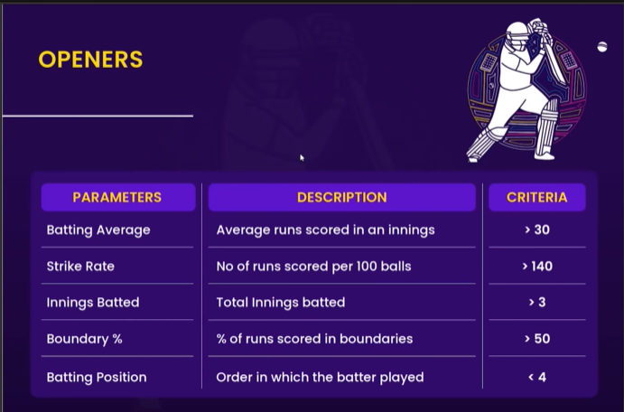
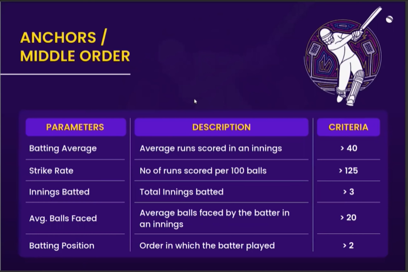
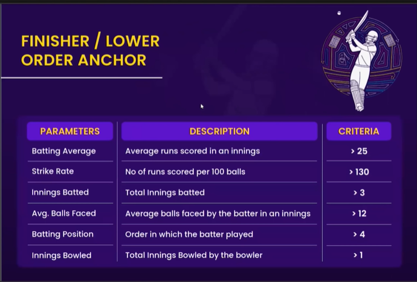
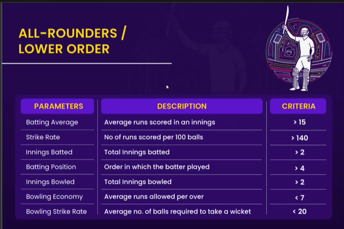
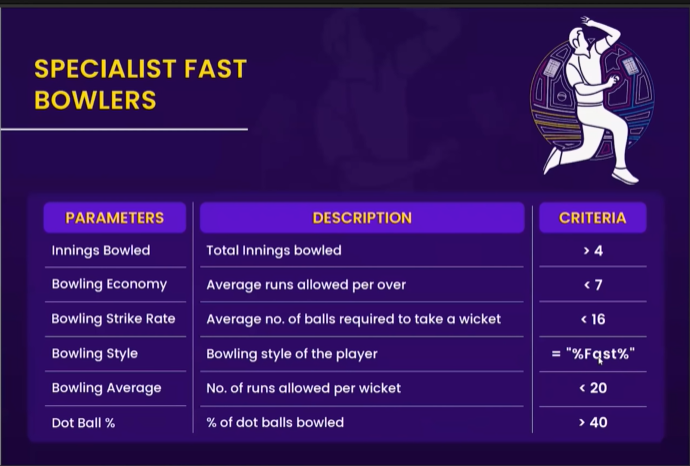

# 🏏 ICC Men's T20 Cricket World Cup 2022 — Data Analytics Dashboard


---

# 📌 Project Overview

This project is a comprehensive **Player Performance Analytics Dashboard** built on **ICC Men's T20 Cricket World Cup 2022** data.

Using **Python** for web scraping and data preprocessing and **Power BI** for visualization, the dashboard allows users to:

- 📊 Analyse & compare individual player performances across all World Cup matches
- 🧠 Pick the best Final Playing 11 from the entire tournament pool based on data-driven selection criteria
- 🔍 Explore players by role — **Power Hitters, Anchors, Finishers, All-Rounders, and Specialist Fast Bowlers**

> 💡 **To interact with the dashboard, download the `T20 Analytics Dashboard.pbix` file from this repository and open it in Microsoft Power BI Desktop.**

---

# 📋 Table of Contents

- 📌 Project Overview
- ❓ Problem Statement
- 📂 Dataset Information
- 🔄 Project Workflow
- 🌐 Data Collection
- 🧹 Data Transformation
- 🗃️ Data Modelling
- ⚙️ DAX Measures
- 🎯 Player Selection Criteria
- 📊 Dashboard Screenshots
- 🛠️ Tools & Technologies
- 📎 References
- 🙌 Acknowledgements

---

# ❓ Problem Statement

Cricket coaches, analysts, and fans often struggle to objectively compare player performances across different teams and playing conditions.

This project solves that challenge by building an interactive Power BI dashboard that:

- Reviews and compares all player performances from the ICC Men's T20 World Cup 2022.
- Enables users to build their own Final Playing 11 from the complete tournament player pool.
- Evaluates players using clearly defined role-specific performance metrics such as Batting Average, Strike Rate, Economy, Bowling Average, and Dot Ball Percentage.

---

# 📂 Dataset Information

| Detail | Information |
|----------------------|--------------------------------------------|
| **Source** | ESPN Cricinfo |
| **Scraping Tool** | Bright Data + BeautifulSoup |
| **Tournament** | ICC Men's T20 Cricket World Cup 2022 (Australia) |
| **Coverage** | Qualifier Stage + Super 12 |
| **Data Types** | Match Results, Batting Summaries, Bowling Summaries, Player Information |

## 📁 Key Files Used

- **t20_batting_summary** — Innings-level batting statistics per player per match
- **t20_bowling_summary** — Innings-level bowling statistics per player per match
- **t20_players_info** — Player metadata (team, batting style, bowling style, playing role)
- **t20_match_results** — Match-level information and match IDs

---

# 🔄 Project Workflow

```text
Requirement Scoping
      ↓
Web Scraping
(ESPN Cricinfo via Bright Data + BeautifulSoup)
      ↓
Data Cleaning & Preprocessing
(Python + Pandas)
      ↓
Data Transformation
(Power Query in Power BI)
      ↓
Data Modelling & DAX
(Power BI)
      ↓
Dashboard Building
```

---

# 🌐 Data Collection

All match and player data was scraped from **ESPN Cricinfo** using **Bright Data** as the proxy/scraping infrastructure and **BeautifulSoup** as the HTML parser.

The raw scraped data was collected in **JSON format**, converted into **Pandas DataFrames** using **Jupyter Notebook**, and exported as **CSV files** for further processing inside Power BI.

---

# 🧹 Data Transformation

The project involved two stages of data transformation.

## Stage 1 — Python (Pandas)

- ✅ Corrected player name inconsistencies
- ✅ Handled missing values
- ✅ Linked match IDs across batting and bowling datasets

## Stage 2 — Power Query (Power BI)

- ✅ Final data shaping and column renaming
- ✅ Merged datasets for model-ready tables
- ✅ Created conditional columns for role-based filtering

---

# 🗃️ Data Modelling

All tables were connected using well-defined primary keys.

| Primary Key | Purpose |
|----------------|---------------------------------------------|
| **matchID** | Links batting summary, bowling summary, and match results |
| **team** | Links player information with match data |

Additional calculated columns and parameters were created to enable dynamic player selection and role-based filtering directly inside the dashboard.

---

# ⚙️ DAX Measures

## 🏏 Batting Measures

```DAX
Total Runs =
SUM(t20_batting_summary[runs])

Total Innings Batted =
COUNT(t20_batting_summary[matchID])

Total Innings Dismissed =
SUM(t20_batting_summary[Out])

Batting Avg =
DIVIDE([Total Runs], [Total Innings Dismissed], 0)

Total Balls Faced =
SUM(t20_batting_summary[balls])

Strike Rate =
DIVIDE([Total Runs], [Total Balls Faced], 0) * 100

Batting Position =
ROUNDUP(AVERAGE(t20_batting_summary[battingPos]), 0)

Boundary % =
DIVIDE(
SUM(t20_batting_summary[Boundary runs]),
[Total Runs],
0
) * 100

Avg. Balls Faced =
AVERAGE(t20_batting_summary[balls])

Boundary Runs Batting =
t20_batting_summary[fours] * 4 +
t20_batting_summary[sixes] * 6
```
## 🎯 Bowling Measures

```DAX
Wickets =
SUM(t20_bowling_summary[wickets])

Balls Bowled =
SUM(t20_bowling_summary[balls])

Runs Conceded =
SUM(t20_bowling_summary[runs])

Economy =
DIVIDE([Runs Conceded], ([Balls Bowled] / 6), 0)

Bowling Strike Rate =
DIVIDE([Balls Bowled], [Wickets], 0)

Bowling Average =
DIVIDE([Runs Conceded], [Wickets], 0)

Total Innings Bowled =
DISTINCTCOUNT(t20_bowling_summary[matchID])

Dot Ball % =
DIVIDE(
SUM(t20_bowling_summary[zeros]),
SUM(t20_bowling_summary[balls]),
0
)

Boundary Runs Bowling =
t20_bowling_summary[fours] * 4 +
t20_bowling_summary[sixes] * 6
```

---

## 🧩 Dynamic Selection Measures

```DAX
Player Selection =
IF(ISFILTERED(t20_players_info[name]), "1", "0")

Display Text =
IF(
    [Player Selection] = "1",
    " ",
    "Select Player(s) by clicking the player's name to see their individual or combined strength"
)

Color Callout Value =
IF(
    [Player Selection] = "0",
    "#E8D166",
    "#1D1D2E"
)
```

---

# 🎯 Player Selection Criteria

One of the most powerful features of this dashboard is the ability to build your own **Final Playing 11** using data-driven criteria.

Each player role has a clearly defined set of parameters and minimum thresholds that a player must meet to be considered for that position.

The criteria were defined as part of the problem statement and are used to filter and rank players across all **5 roles**.

---

# 💥 Openers / Power Hitters

Openers need to score quickly right from ball one — they're evaluated on high strike rate, good average, and boundary dominance.

<p align="center">
  
</p>

<table align="center" width="75%">
  <tr>
    <th>Parameter</th>
    <th>Description</th>
    <th>Criteria</th>
  </tr>
  <tr>
    <td>Batting Average</td>
    <td>Average runs scored in an innings</td>
    <td>&gt; 30</td>
  </tr>
  <tr>
    <td>Strike Rate</td>
    <td>No. of runs scored per 100 balls</td>
    <td>&gt; 140</td>
  </tr>
  <tr>
    <td>Innings Batted</td>
    <td>Total innings batted</td>
    <td>&gt; 3</td>
  </tr>
  <tr>
    <td>Boundary %</td>
    <td>% of runs scored in boundaries</td>
    <td>&gt; 50</td>
  </tr>
  <tr>
    <td>Batting Position</td>
    <td>Order in which the batter played</td>
    <td>&lt; 4</td>
  </tr>
</table>

---

# ⚓ Anchors / Middle Order

Anchors are the backbone of the batting lineup — they need consistency and the ability to stay at the crease while building partnerships.

<p align="center">
  
</p>

<table align="center" width="75%">
  <tr>
    <th>Parameter</th>
    <th>Description</th>
    <th>Criteria</th>
  </tr>
  <tr>
    <td>Batting Average</td>
    <td>Average runs scored in an innings</td>
    <td>&gt; 40</td>
  </tr>
  <tr>
    <td>Strike Rate</td>
    <td>No. of runs scored per 100 balls</td>
    <td>&gt; 125</td>
  </tr>
  <tr>
    <td>Innings Batted</td>
    <td>Total innings batted</td>
    <td>&gt; 3</td>
  </tr>
  <tr>
    <td>Avg. Balls Faced</td>
    <td>Average balls faced by the batter in an innings</td>
    <td>&gt; 20</td>
  </tr>
  <tr>
    <td>Batting Position</td>
    <td>Order in which the batter played</td>
    <td>&gt; 2</td>
  </tr>
</table>

---

# 🏁 Finishers / Lower Order Anchors

Finishers must be able to accelerate at the death and have the ability to contribute with the ball too.

<p align="center">
  
</p>

<table align="center" width="75%">
  <tr>
    <th>Parameter</th>
    <th>Description</th>
    <th>Criteria</th>
  </tr>
  <tr>
    <td>Batting Average</td>
    <td>Average runs scored in an innings</td>
    <td>&gt; 25</td>
  </tr>
  <tr>
    <td>Strike Rate</td>
    <td>No. of runs scored per 100 balls</td>
    <td>&gt; 130</td>
  </tr>
  <tr>
    <td>Innings Batted</td>
    <td>Total innings batted</td>
    <td>&gt; 3</td>
  </tr>
  <tr>
    <td>Avg. Balls Faced</td>
    <td>Average balls faced by the batter in an innings</td>
    <td>&gt; 12</td>
  </tr>
  <tr>
    <td>Batting Position</td>
    <td>Order in which the batter played</td>
    <td>&gt; 4</td>
  </tr>
  <tr>
    <td>Innings Bowled</td>
    <td>Total innings bowled by the bowler</td>
    <td>&gt; 1</td>
  </tr>
</table>

---

# 🔄 All-Rounders / Lower Middle Order

All-Rounders must contribute both with bat and ball — they're evaluated on a combined batting and bowling threshold.

<p align="center">
  
</p>

<table align="center" width="75%">
  <tr>
    <th>Parameter</th>
    <th>Description</th>
    <th>Criteria</th>
  </tr>
  <tr>
    <td>Batting Average</td>
    <td>Average runs scored in an innings</td>
    <td>&gt; 15</td>
  </tr>
  <tr>
    <td>Strike Rate</td>
    <td>No. of runs scored per 100 balls</td>
    <td>&gt; 140</td>
  </tr>
  <tr>
    <td>Innings Batted</td>
    <td>Total innings batted</td>
    <td>&gt; 2</td>
  </tr>
  <tr>
    <td>Batting Position</td>
    <td>Order in which the batter played</td>
    <td>&gt; 4</td>
  </tr>
  <tr>
    <td>Innings Bowled</td>
    <td>Total innings bowled</td>
    <td>&gt; 2</td>
  </tr>
  <tr>
    <td>Bowling Economy</td>
    <td>Average runs allowed per over</td>
    <td>&lt; 7</td>
  </tr>
  <tr>
    <td>Bowling Strike Rate</td>
    <td>Average no. of balls required to take a wicket</td>
    <td>&lt; 20</td>
  </tr>
</table>

---

# 🎳 Specialist Fast Bowlers / Tail End

Specialist fast bowlers are selected purely on bowling performance — economy, wicket-taking ability, and dot ball pressure are the key metrics.

<p align="center">
  
</p>

<table align="center" width="75%">
  <tr>
    <th>Parameter</th>
    <th>Description</th>
    <th>Criteria</th>
  </tr>
  <tr>
    <td>Innings Bowled</td>
    <td>Total innings bowled</td>
    <td>&gt; 4</td>
  </tr>
  <tr>
    <td>Bowling Economy</td>
    <td>Average runs allowed per over</td>
    <td>&lt; 7</td>
  </tr>
  <tr>
    <td>Bowling Strike Rate</td>
    <td>Average no. of balls required to take a wicket</td>
    <td>&lt; 16</td>
  </tr>
  <tr>
    <td>Bowling Style</td>
    <td>Bowling style of the player</td>
    <td>= "%Fast%"</td>
  </tr>
  <tr>
    <td>Bowling Average</td>
    <td>No. of runs allowed per wicket</td>
    <td>&lt; 20</td>
  </tr>
  <tr>
    <td>Dot Ball %</td>
    <td>% of dot balls bowled</td>
    <td>&gt; 40</td>
  </tr>
</table>

---
