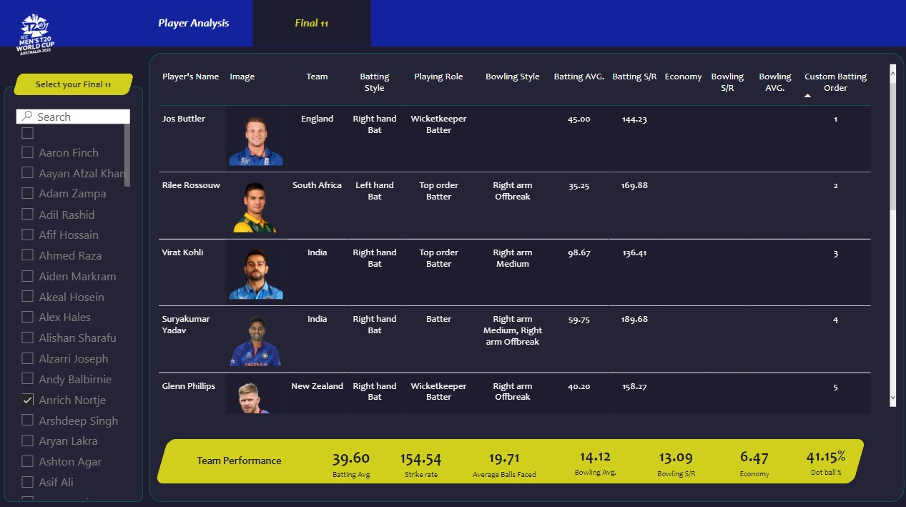
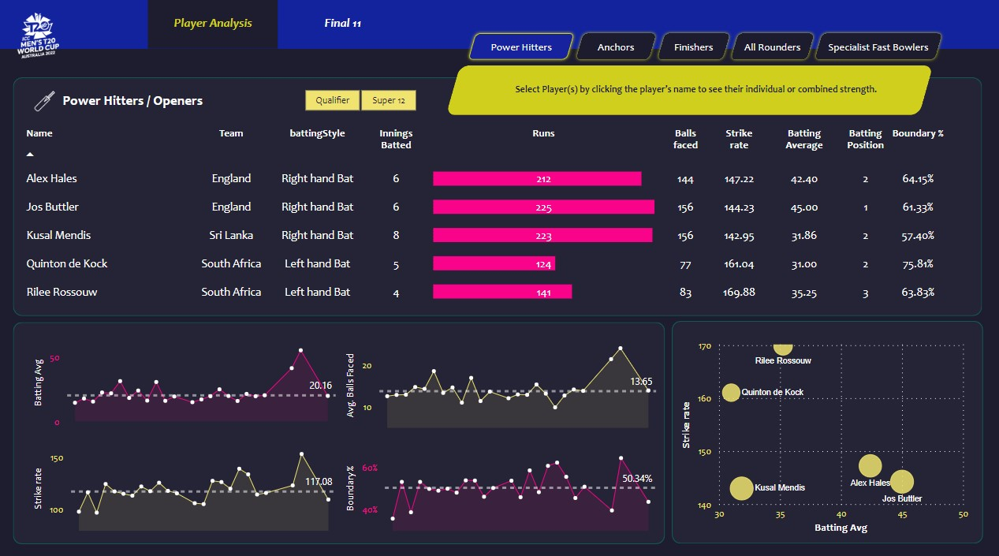
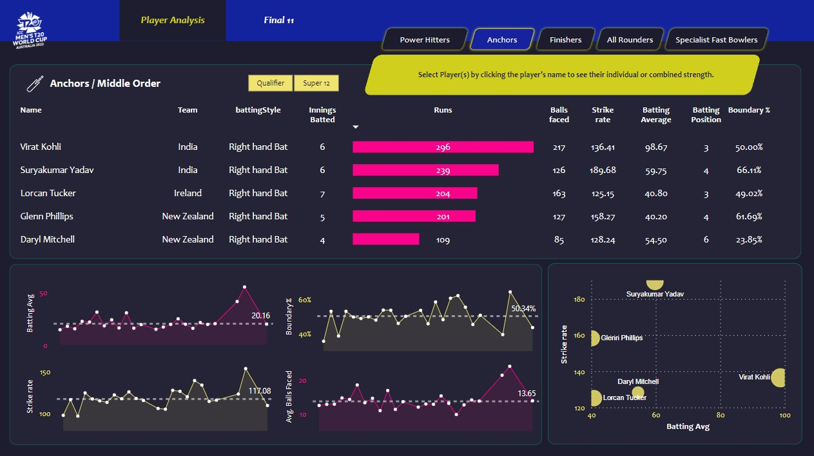
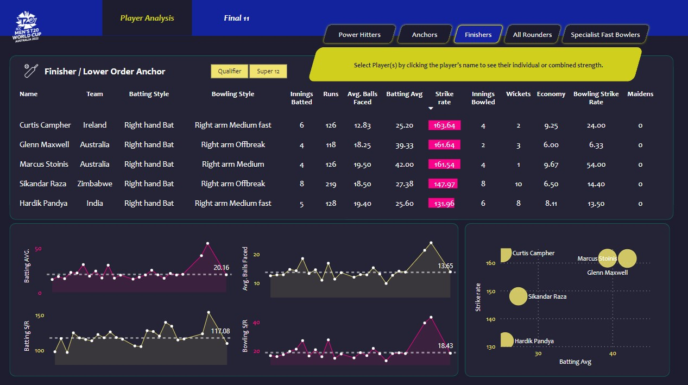
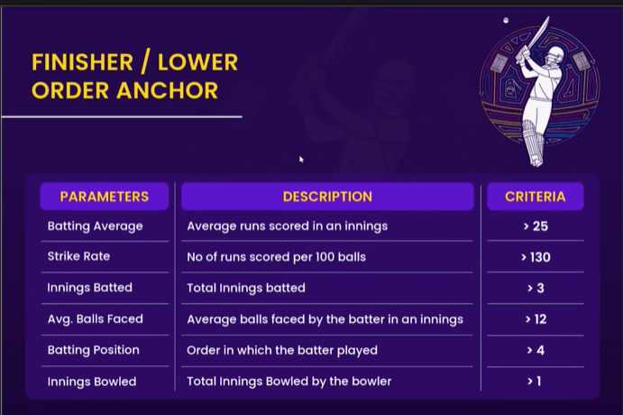
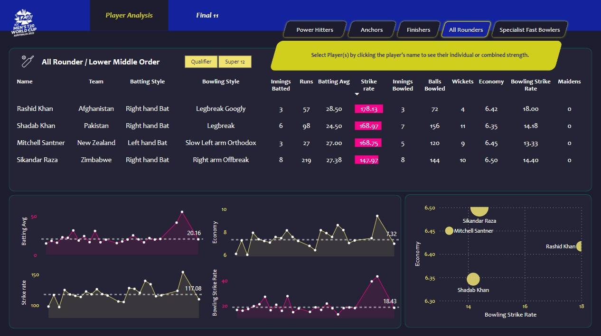

# 🏏 ICC Men's T20 Cricket World Cup 2022 — Data Analytics Dashboard


---

# 📌 Project Overview

This project is a comprehensive **Player Performance Analytics Dashboard** built using **ICC Men's T20 Cricket World Cup 2022** data.

Using **Python** for web scraping and data preprocessing and **Power BI** for visualization, the dashboard enables users to analyze player performances and build an optimal **Final Playing 11** based on role-specific selection criteria.

## ✨ Key Features

- 📊 Analyse and compare individual player performances across all World Cup matches
- 🧠 Build the best Final Playing 11 using data-driven selection criteria
- 🔍 Explore players by role: Power Hitters, Anchors, Finishers, All-Rounders, and Specialist Fast Bowlers
- 📈 Interactive dashboard with dynamic filters and KPIs

> 💡 Download **T20 Analytics Dashboard.pbix** from this repository and open it in **Power BI Desktop** to explore the dashboard.

---

# 📋 Table of Contents

- Problem Statement
- Dataset Information
- Project Workflow
- Data Collection
- Data Transformation
- Data Modelling
- DAX Measures
- Player Selection Criteria
- Dashboard Screenshots
- Tools & Technologies
- References
- Acknowledgements

---

# ❓ Problem Statement

Cricket coaches, analysts, and fans often struggle to objectively compare player performances across different teams and playing conditions.

This project solves that challenge by providing an interactive dashboard that:

- Reviews and compares all player performances from the ICC Men's T20 World Cup 2022.
- Enables users to build their own Final Playing 11 from the tournament pool.
- Evaluates players using role-specific performance metrics such as Batting Average, Strike Rate, Economy, Bowling Average, and Dot Ball Percentage.

---

# 📂 Dataset Information

| Detail | Information |
|----------------------|--------------------------------|
| Source | ESPN Cricinfo |
| Scraping Tool | Bright Data + BeautifulSoup |
| Tournament | ICC Men's T20 Cricket World Cup 2022 (Australia) |
| Coverage | Qualifier Stage + Super 12 |
| Data Types | Match Results, Batting Summary, Bowling Summary, Player Information |

### 📁 Files Used

- **t20_batting_summary** — Innings-level batting statistics
- **t20_bowling_summary** — Innings-level bowling statistics
- **t20_players_info** — Player metadata
- **t20_match_results** — Match information

---

# 🔄 Project Workflow

```
Requirement Scoping
        ↓
Web Scraping
(ESPN Cricinfo + Bright Data + BeautifulSoup)
        ↓
Data Cleaning & Preprocessing
(Python + Pandas)
        ↓
Data Transformation
(Power Query)
        ↓
Data Modelling & DAX
(Power BI)
        ↓
Interactive Dashboard Development
```

---

# 🌐 Data Collection

All match and player data was scraped from **ESPN Cricinfo** using **Bright Data** as the scraping infrastructure and **BeautifulSoup** as the HTML parser.

The scraped JSON data was converted into **Pandas DataFrames** using Jupyter Notebook and exported as CSV files for further processing in Power BI.

---

# 🧹 Data Transformation

## Stage 1 — Python (Pandas)

- Corrected player name inconsistencies
- Handled missing values
- Linked match IDs across batting and bowling tables

## Stage 2 — Power Query

- Final data shaping
- Column renaming
- Dataset merging
- Conditional columns for role-based filtering

---

# 🗃️ Data Modelling

Tables were connected using primary keys:

- **matchID** → Links batting summary, bowling summary and match results
- **team** → Links player information with match data

Additional calculated columns and DAX measures enable dynamic player selection and interactive analysis.

---

# ⚙️ Key DAX Measures

## 🏏 Batting

```DAX
Total Runs = SUM(t20_batting_summary[runs])

Total Innings Batted = COUNT(t20_batting_summary[matchID])

Total Innings Dismissed = SUM(t20_batting_summary[Out])

Batting Avg = DIVIDE([Total Runs], [Total Innings Dismissed], 0)

Total Balls Faced = SUM(t20_batting_summary[balls])

Strike Rate = DIVIDE([Total Runs], [Total Balls Faced], 0) * 100

Batting Position = ROUNDUP(AVERAGE(t20_batting_summary[battingPos]), 0)

Boundary % = DIVIDE(SUM(t20_batting_summary[Boundary runs]), [Total Runs], 0) * 100

Avg. Balls Faced = AVERAGE(t20_batting_summary[balls])

Boundary Runs Batting = t20_batting_summary[fours] * 4 + t20_batting_summary[sixes] * 6
```

## 🎯 Bowling

```DAX
Wickets = SUM(t20_bowling_summary[wickets])

Balls Bowled = SUM(t20_bowling_summary[balls])

Runs Conceded = SUM(t20_bowling_summary[runs])

Economy = DIVIDE([Runs Conceded], ([Balls Bowled] / 6), 0)

Bowling Strike Rate = DIVIDE([Balls Bowled], [Wickets], 0)

Bowling Average = DIVIDE([Runs Conceded], [Wickets], 0)

Total Innings Bowled = DISTINCTCOUNT(t20_bowling_summary[matchID])

Dot Ball % = DIVIDE(SUM(t20_bowling_summary[zeros]), SUM(t20_bowling_summary[balls]), 0)

Boundary Runs Bowling = t20_bowling_summary[fours] * 4 + t20_bowling_summary[sixes] * 6
```

---

# 🎯 Player Selection Criteria

## 💥 Power Hitters / Openers

| Parameter | Criteria |
|----------------|------------|
| Batting Average | > 30 |
| Strike Rate | > 140 |
| Innings Batted | > 3 |
| Boundary % | > 50 |
| Batting Position | < 4 |

---

## ⚓ Anchors / Middle Order

| Parameter | Criteria |
|----------------|------------|
| Batting Average | > 40 |
| Strike Rate | > 125 |
| Innings Batted | > 3 |
| Avg Balls Faced | > 20 |
| Batting Position | > 2 |

---

## 🏁 Finishers

| Parameter | Criteria |
|----------------|------------|
| Batting Average | > 25 |
| Strike Rate | > 130 |
| Innings Batted | > 3 |
| Avg Balls Faced | > 12 |
| Batting Position | > 4 |
| Innings Bowled | > 1 |

---

## 🔄 All-Rounders

| Parameter | Criteria |
|----------------|------------|
| Batting Average | > 15 |
| Strike Rate | > 140 |
| Innings Batted | > 2 |
| Batting Position | > 4 |
| Innings Bowled | > 2 |
| Bowling Economy | < 7 |
| Bowling Strike Rate | < 20 |

---

## 🎳 Specialist Fast Bowlers

| Parameter | Criteria |
|----------------|------------|
| Innings Bowled | > 4 |
| Bowling Economy | < 7 |
| Bowling Strike Rate | < 16 |
| Bowling Style | Fast |
| Bowling Average | < 20 |
| Dot Ball % | > 40 |

---

# 📊 Dashboard Screenshots

## 🔢 Final Playing 11

<p align="center">

</p>

---

## 💥 Power Hitters

<p align="center">

</p>

### Selection Criteria

<p align="center">

</p>

---

## ⚓ Anchors

<p align="center">

</p>

### Selection Criteria

<p align="center">

</p>

---

## 🏁 Finishers

<p align="center">

</p>

### Selection Criteria

<p align="center">

</p>

<p align="center">

</p>

---

## 🔄 All-Rounders

<p align="center">

</p>

### Selection Criteria

<p align="center">

</p>

---

## 🎳 Specialist Fast Bowlers

<p align="center">

</p>

### Selection Criteria

<p align="center">

</p>

---

# 🛠️ Tools & Technologies

| Tool | Purpose |
|----------------------------|--------------------------------|
| Python | Core Programming |
| Pandas | Data Cleaning & Analysis |
| BeautifulSoup | HTML Parsing |
| Bright Data | Web Scraping Infrastructure |
| Jupyter Notebook | Data Processing |
| Power Query | Data Transformation |
| Power BI Desktop | Dashboard Development |
| DAX | Measures & KPIs |
| ESPN Cricinfo | Primary Data Source |

---

# 📎 References

- ESPN Cricinfo
- Bright Data
- Microsoft Power BI Documentation
- Pandas Documentation

---

# 🙌 Acknowledgements

Special thanks to the open cricket data community and ESPN Cricinfo for making player and match statistics publicly accessible for analytical projects.

---

# ⭐ Support

If you found this project useful, please consider giving it a **⭐ Star** on GitHub.
